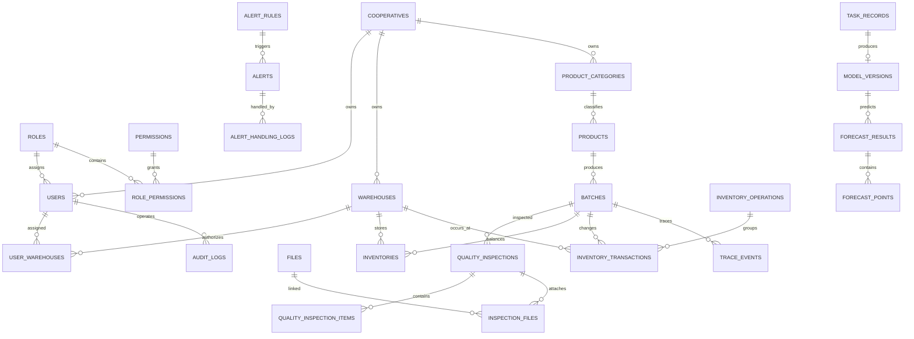

# 农产品批次追溯与智能库存预警系统数据库设计说明书

## 1. 文档信息

| 项目 | 内容 |
|---|---|
| 数据库 | PostgreSQL 15+ |
| 字符集 | UTF-8 |
| 时区 | 数据库存储 `timestamptz`，接口统一输出 ISO 8601 |
| 主键 | UUID，数据库通过 `gen_random_uuid()` 生成 |
| 结构版本来源 | Alembic 迁移 |
| 文档状态 | V1 初始设计 |

本文设计覆盖需求文档和接口文档中的 V1 数据。Redis 仅保存会话、缓存、限流计数及 Celery 消息，不作为库存或审计数据的唯一来源。

## 2. 设计原则

1. 所有业务主键使用 UUID，避免对外暴露自增规模。
2. 多租户业务表显式保存 `cooperative_id`，查询必须先限定合作社范围。
3. 数量统一使用 `NUMERIC(14,3)`，禁止用浮点数保存库存。
4. 状态使用 `VARCHAR + CHECK`，便于迁移时增加状态值。
5. 当前库存用于快速查询，库存流水用于审计；二者必须在同一事务中更新。
6. 一个业务用例对应一个 Service 事务：API 依赖层只提供普通数据库 Session，Service 使用 `async with session.begin()` 建立事务，Repository 只负责查询、写入和 `flush()`，禁止 `commit()`。
7. PostgreSQL `IntegrityError` 在接口层统一转换为 409；唯一键和外键冲突分别使用明确错误码，无法识别的数据库异常记录日志并返回 500。
8. 所有错误响应都包含请求 ID；请求 ID 同时通过 `X-Request-ID` 响应头和错误体 `error.requestId` 返回。
6. 已完成库存流水和审计日志只允许新增，不允许业务接口修改或删除。
7. 业务数据原则上停用而不物理删除；关联表可在主记录删除时级联清理。
8. AI 模型粒度固定为一个“仓库＋产品”，预测周期只允许 7 天或 30 天。
9. 质检附件和仓库调拨虽为 P1，初始结构提前预留，避免后续破坏性迁移。
10. 演示数据必须标记为 `SYNTHETIC`，不得混充真实经营数据。

## 3. 角色与身份模型

系统有三种需要登录的后台角色：系统管理员、合作社管理员、仓库工作人员。消费者无需账号，通过追溯码访问公开接口，因此不写入 `roles` 表。V1 每个后台用户只分配一个角色，`users.role_id` 直接关联角色；角色与权限是多对多关系。

刷新令牌不写入 PostgreSQL：令牌只在 HttpOnly Cookie 中传输，其会话摘要、用户 ID、过期时间和撤销状态存入 Redis。登录和退出行为仍写入 `audit_logs`。

## 4. ER 关系图

为保持图可读性，图中省略了多数业务表到 `cooperatives`、`users`、`warehouses` 和 `products` 的重复关联。

## 5. 表结构

### 5.1 组织、认证与权限

#### `cooperatives` 合作社

| 字段 | 类型 | 约束/说明 |
|---|---|---|
| id | UUID | 主键 |
| code | VARCHAR(32) | 全局唯一，业务编码 |
| name | VARCHAR(100) | 非空 |
| contact_name | VARCHAR(50) | 可空 |
| contact_phone | VARCHAR(20) | 可空 |
| address | VARCHAR(255) | 可空 |
| status | VARCHAR(16) | `ACTIVE` / `INACTIVE` |
| created_at, updated_at | TIMESTAMPTZ | 非空 |

#### `roles`、`permissions`、`role_permissions`

| 表 | 关键字段 | 约束/说明 |
|---|---|---|
| roles | id, code, name, description, is_system, created_at, updated_at | `code` 全局唯一 |
| permissions | id, code, name, module, description, created_at, updated_at | `code` 全局唯一 |
| role_permissions | role_id, permission_id | 联合主键；删除角色或权限时级联清理关联 |

#### `users` 用户

| 字段 | 类型 | 约束/说明 |
|---|---|---|
| id | UUID | 主键 |
| cooperative_id | UUID | 系统管理员可空，其他用户非空；关联合作社 |
| role_id | UUID | 非空，关联角色 |
| username | VARCHAR(50) | 全局唯一，统一转为小写保存 |
| password_hash | VARCHAR(255) | 非空，仅保存 Argon2 哈希 |
| real_name | VARCHAR(50) | 非空 |
| phone | VARCHAR(20) | 可空 |
| status | VARCHAR(16) | `ACTIVE` / `LOCKED` / `INACTIVE` |
| last_login_at | TIMESTAMPTZ | 可空 |
| created_at, updated_at | TIMESTAMPTZ | 非空 |

“仅系统管理员可不属于合作社”涉及角色表数据，数据库 CHECK 无法跨表判断，由用户服务在事务中校验。

#### `warehouses`、`user_warehouses`

| 表 | 关键字段 | 约束/说明 |
|---|---|---|
| warehouses | id, cooperative_id, code, name, address, manager_name, status, created_at, updated_at | `(cooperative_id, code)` 唯一 |
| user_warehouses | user_id, warehouse_id, created_at | 联合主键；只给仓库工作人员配置；服务层校验双方属于同一合作社 |

### 5.2 产品、批次与质检

#### `product_categories`、`products`

| 表 | 关键字段 | 约束/说明 |
|---|---|---|
| product_categories | id, cooperative_id, code, name, description, is_active, created_at, updated_at | `(cooperative_id, code)` 和 `(cooperative_id, name)` 唯一 |
| products | id, cooperative_id, category_id, code, name, unit, shelf_life_days, safety_stock, is_active, created_at, updated_at | `(cooperative_id, code)` 唯一；保质期大于 0，安全库存不小于 0 |

#### `batches` 批次

| 字段 | 类型 | 约束/说明 |
|---|---|---|
| id | UUID | 主键 |
| cooperative_id, product_id | UUID | 非空外键 |
| batch_no | VARCHAR(64) | 全局唯一，创建后不允许业务修改 |
| trace_code | VARCHAR(64) | 全局唯一，用于二维码公开查询 |
| origin | VARCHAR(255) | 产地 |
| production_date, expiry_date | DATE | 到期日期不得早于生产日期 |
| responsible_person | VARCHAR(50) | 可空 |
| status | VARCHAR(20) | `CREATED` / `IN_STOCK` / `DEPLETED` / `BLOCKED` / `EXPIRED` |
| created_by | UUID | 创建用户 |
| created_at, updated_at | TIMESTAMPTZ | 非空 |

#### 质检与附件

| 表 | 关键字段 | 约束/说明 |
|---|---|---|
| quality_inspections | id, cooperative_id, batch_id, inspection_no, inspected_at, inspector_id, conclusion, remarks, original_inspection_id, created_at, updated_at | `(cooperative_id, inspection_no)` 唯一；结论为 `PENDING/PASSED/FAILED`；更正记录可关联原记录 |
| quality_inspection_items | id, inspection_id, item_name, unit, standard_value, result_value, is_qualified, sort_order, created_at | 同一次质检的 `(inspection_id, item_name)` 唯一；`unit` 可空 |
| files | id, cooperative_id, original_name, storage_key, mime_type, size_bytes, sha256, uploaded_by, created_at | `storage_key` 全局唯一；大小大于 0 |
| inspection_files | inspection_id, file_id, created_at | 联合主键，连接质检与文件 |

`files` 只保存元数据，文件内容保存在本地受控目录或对象存储；下载前必须校验合作社和质检访问权限。

### 5.3 库存与追溯

#### `inventories` 当前库存

| 字段 | 类型 | 约束/说明 |
|---|---|---|
| id | UUID | 主键 |
| cooperative_id, warehouse_id, batch_id | UUID | 非空外键 |
| quantity | NUMERIC(14,3) | 非空且不小于 0 |
| locked_quantity | NUMERIC(14,3) | 非空且在 0 到 `quantity` 之间 |
| version | INTEGER | 乐观锁版本，不小于 0 |
| updated_at | TIMESTAMPTZ | 非空 |

`(warehouse_id, batch_id)` 唯一。可用库存为 `quantity - locked_quantity`，扣减时必须锁定该行或使用带版本条件的更新。

#### `inventory_operations` 库存操作头

| 字段 | 类型 | 约束/说明 |
|---|---|---|
| id | UUID | 主键 |
| cooperative_id | UUID | 非空外键 |
| operation_no | VARCHAR(64) | 全局唯一 |
| operation_type | VARCHAR(24) | `INBOUND/OUTBOUND/ADJUSTMENT/DAMAGE/TRANSFER` |
| source_warehouse_id, destination_warehouse_id | UUID | 调拨时分别非空且不能相同 |
| external_reference | VARCHAR(100) | 外部单号，可空 |
| reason | VARCHAR(500) | 盘点、报损等操作说明，可空 |
| occurred_at | TIMESTAMPTZ | 业务发生时间 |
| status | VARCHAR(16) | `COMPLETED` / `REVERSED` |
| created_by, created_at | UUID, TIMESTAMPTZ | 创建人和创建时间 |

同一调拨操作由一条 `TRANSFER_OUT` 和一条 `TRANSFER_IN` 流水组成，并在一个数据库事务内完成。

#### `inventory_transactions` 库存流水

| 字段 | 类型 | 约束/说明 |
|---|---|---|
| id | UUID | 主键 |
| cooperative_id, operation_id, warehouse_id, batch_id | UUID | 非空外键 |
| transaction_type | VARCHAR(24) | `INBOUND/OUTBOUND/ADJUSTMENT/DAMAGE/TRANSFER_OUT/TRANSFER_IN` |
| quantity_delta | NUMERIC(14,3) | 非零有符号变更量 |
| quantity_before, quantity_after | NUMERIC(14,3) | 均不小于 0，且满足前值＋变更量＝后值 |
| occurred_at | TIMESTAMPTZ | 业务发生时间 |
| created_by, created_at | UUID, TIMESTAMPTZ | 操作人和写入时间 |

流水只追加。错误通过新增 `ADJUSTMENT` 操作纠正，不覆盖原记录。

#### `trace_events` 追溯事件

| 字段 | 类型 | 约束/说明 |
|---|---|---|
| id, cooperative_id, batch_id | UUID | 主键和外键 |
| event_type | VARCHAR(32) | `PRODUCTION/INSPECTION/INBOUND/OUTBOUND/TRANSFER/OTHER` |
| title | VARCHAR(100) | 公开标题 |
| description | VARCHAR(500) | 内部事件描述，可空；公开接口使用受控描述投影 |
| event_time | TIMESTAMPTZ | 事件时间 |
| source_type, source_id | VARCHAR(32), UUID | 来源业务对象，可空 |
| public_data | JSONB | 仅保存可公开字段，默认空对象 |
| created_by, created_at | UUID, TIMESTAMPTZ | 可空创建人和写入时间 |

### 5.4 预警、任务与幂等

| 表 | 关键字段 | 约束/说明 |
|---|---|---|
| alert_rules | id, cooperative_id, warehouse_id, product_id, alert_type, threshold_quantity, threshold_days, turnover_days, severity, is_enabled, created_at, updated_at | 规则类型为 `LOW_STOCK/NEAR_EXPIRY/OVERSTOCK/QUALITY_FAILED`；阈值不得为负 |
| alerts | id, cooperative_id, rule_id, alert_type, severity, status, warehouse_id, product_id, batch_id, dedupe_key, title, message, evidence, detected_at, resolved_at, assignee_id, created_at, updated_at | 状态为 `PENDING/PROCESSING/RESOLVED/IGNORED`；同一 `dedupe_key` 只允许一个活动预警 |
| alert_handling_logs | id, alert_id, operator_id, from_status, to_status, comment, created_at | 只追加，完整记录处理过程 |
| task_records | id, cooperative_id, task_type, celery_task_id, status, progress, request_payload, result_payload, error_code, error_message, requested_by, started_at, finished_at, created_at, updated_at | Celery ID 唯一；进度为 0–100；状态为 `PENDING/RUNNING/SUCCESS/FAILURE/RETRY` |
| idempotency_records | id, cooperative_id, user_id, endpoint, idempotency_key, request_hash, status, response_status, response_body, expires_at, created_at, updated_at | `(user_id, endpoint, idempotency_key)` 唯一；同键不同请求摘要必须拒绝 |

预警去重通过部分唯一索引实现，仅约束状态为 `PENDING` 或 `PROCESSING` 的记录。已解决或已忽略后，后续扫描可创建新的预警周期。

### 5.5 AI 模型与预测

#### `model_versions`

| 字段 | 类型 | 约束/说明 |
|---|---|---|
| id, cooperative_id, warehouse_id, product_id | UUID | 主键与范围外键 |
| task_id | UUID | 可空，关联训练任务 |
| model_type | VARCHAR(24) | V1 使用 `MOVING_AVERAGE/XGBOOST`；保留 `RANDOM_FOREST` 枚举值供后续扩展 |
| version | VARCHAR(64) | 合作社内唯一 |
| artifact_path | VARCHAR(255) | 模型文件相对路径，可空 |
| data_type | VARCHAR(16) | `SYNTHETIC/REAL` |
| training_start_date, training_end_date | DATE | 开始日期不得晚于结束日期 |
| random_seed | INTEGER | 可复现实验 |
| parameters, metrics | JSONB | 参数和 MAE、RMSE 等指标 |
| is_active | BOOLEAN | 默认 false |
| created_by, created_at | UUID, TIMESTAMPTZ | 创建人和时间 |

部分唯一索引保证同一合作社、仓库和产品最多只有一个 `is_active = true` 的模型。

#### `forecast_results`、`forecast_points`

| 表 | 关键字段 | 约束/说明 |
|---|---|---|
| forecast_results | id, cooperative_id, warehouse_id, product_id, model_version_id, task_id, horizon_days, forecast_start_date, forecast_end_date, predicted_demand, current_stock, recommended_replenishment, data_type, metrics, important_factors, limitation_notice, generated_at | `horizon_days` 只允许 7 或 30；各数量不小于 0；起止范围必须匹配周期 |
| forecast_points | id, forecast_result_id, forecast_date, predicted_quantity, lower_bound, upper_bound | `(forecast_result_id, forecast_date)` 唯一；预测量和区间不小于 0，且下界不大于上界 |

### 5.6 审计日志

#### `audit_logs`

| 字段 | 类型 | 约束/说明 |
|---|---|---|
| id | UUID | 主键 |
| cooperative_id, user_id | UUID | 可空；公开请求或未知用户允许为空 |
| action, module, object_type | VARCHAR | 操作、模块和对象类型 |
| object_id | UUID | 可空 |
| result | VARCHAR(16) | `SUCCESS` / `FAILURE` |
| request_id | VARCHAR(64) | 请求链路标识，可空 |
| ip_address | INET | 可空 |
| user_agent | VARCHAR(500) | 可空 |
| detail | JSONB | 脱敏上下文，默认空对象 |
| created_at | TIMESTAMPTZ | 非空 |

审计日志禁止保存密码、令牌、Cookie 和完整敏感请求体。

## 6. 关键约束

| 规则 | 数据库保障 | 服务层保障 |
|---|---|---|
| 批次号和追溯码唯一 | 唯一约束 | 冲突转换为 409 |
| 库存不能为负 | CHECK | 行锁/乐观锁及事务 |
| 流水前后数量一致 | CHECK：`before + delta = after` | 与当前库存同事务写入 |
| 重复请求不重复扣减 | 幂等联合唯一约束 | 请求摘要比对和结果复用 |
| 调拨原子性 | 操作头关联两条流水 | 单事务写调出与调入 |
| 活动预警去重 | 部分唯一索引 | 计算稳定 `dedupe_key` |
| 单范围一个启用模型 | 部分唯一索引 | 激活时先停用旧模型 |
| 合作社数据隔离 | 业务表带 `cooperative_id` | 每次查询强制租户条件并校验关联归属 |
| 流水与审计不可篡改 | 数据库触发器拒绝 UPDATE/DELETE | 不提供修改和删除接口 |

## 7. 索引设计

除主键和唯一约束自动生成的索引外，建立以下主要索引：

| 索引字段 | 用途 |
|---|---|
| users `(cooperative_id, status)` | 合作社人员列表与登录状态管理 |
| warehouses `(cooperative_id, status)` | 可用仓库筛选 |
| products `(cooperative_id, is_active, name)` | 产品分页搜索 |
| batches `(cooperative_id, product_id, production_date)` | 产品批次列表 |
| batches `(cooperative_id, expiry_date)` | 临期扫描 |
| quality_inspections `(batch_id, inspected_at DESC)` | 批次质检时间线 |
| inventories `(cooperative_id, warehouse_id)` | 仓库库存分页 |
| inventory_transactions `(cooperative_id, warehouse_id, occurred_at DESC)` | 仓库流水查询 |
| inventory_transactions `(batch_id, occurred_at)` | 批次追溯及销量特征 |
| trace_events `(batch_id, event_time, id)` | 稳定排序的公开时间线 |
| alerts `(cooperative_id, status, severity, detected_at DESC)` | 预警工作台 |
| task_records `(cooperative_id, created_at DESC)` | 异步任务查询 |
| forecast_results `(cooperative_id, warehouse_id, product_id, generated_at DESC)` | 最新预测查询 |
| audit_logs `(cooperative_id, created_at DESC)` | 审计检索 |

索引不重复覆盖低选择性字段；后续依据真实查询计划再调整。

## 8. Redis 数据边界

| Key 示例 | 内容 | TTL/说明 |
|---|---|---|
| `auth:session:{sid}` | 用户ID、会话族、刷新令牌当前状态和撤销状态 | 不超过刷新令牌有效期；同一登录会话的访问令牌共享 `sid` |
| `auth:fail:{username}:{ip}` | 登录失败计数 | 短时过期 |
| `{redis_key_prefix}trace:{trace_code}` | 脱敏追溯响应 | 批次、质检、库存或追溯事件变化后主动失效 |
| `dashboard:{coop_id}:{scope_hash}` | 大屏统计缓存 | 短 TTL |
| `{redis_key_prefix}query:{resource}:{namespace}:{digest}` | 范围隔离的 API 查询响应 | TTL 带随机抖动；主数据、模型、批次或质检变化后按资源失效 |
| `{redis_key_prefix}query:role-list:global:{digest}` / `permission-list` | 角色和权限字典响应 | 角色权限绑定修改或部署后失效 |
| Celery 内部 Key | 消息 | 由 Celery 配置管理 |

查询响应缓存仅保存可由 PostgreSQL 重建的数据，不保存库存最终判断、流水、审计日志、任务状态或用户实时权限上下文。缓存键摘要包含合作社、角色、可见仓库集合和查询参数；权限校验先于缓存读取。Redis 故障时查询响应回源 PostgreSQL，配置 `QUERY_CACHE_ENABLED=false` 也可关闭新增查询缓存；登录会话校验、刷新令牌轮换、退出撤销和登录失败限流不能安全完成，相关认证请求失败关闭；无法确认身份时返回 `503 DEPENDENCY_UNAVAILABLE`，不将基础设施故障误判为 `401`。库存最终判断始终依赖 PostgreSQL。

## 9. 删除与归档策略

- 合作社、用户、仓库、产品通过状态字段停用，不提供常规物理删除。
- 批次、库存操作、库存流水、追溯事件、预警处理记录、模型版本、预测结果和审计日志保留历史。
- `role_permissions`、`user_warehouses`、`inspection_files` 等纯关联数据可随主记录级联删除。
- 达到保存期限后的日志归档属于后续运维功能，不纳入 V1 自动清理。

## 10. 合成演示数据方案

默认生成数据使用固定种子 `20260904`，V1 默认规模如下：

| 数据 | 数量 |
|---|---:|
| 合作社 | 2 |
| 仓库 | 4 |
| 后台用户 | 7（含1名系统管理员） |
| 产品分类 / 产品 | 4 / 8 |
| 批次 / 质检记录 | 24 / 24 |
| 90天历史库存流水 | 每个仓库产品组合按日生成 |
| 活动及历史预警 | 不少于12 |
| 模型版本 | 每个合作社至少2个 |
| 预测结果 | 每个启用模型包含7天明细 |

生成器输出文件头、模型 `data_type` 和预测限制说明均明确标注 `SYNTHETIC`。姓名、电话、地址、业务数量均为虚构内容；所有演示账号使用同一个公开说明的演示密码哈希，不得用于生产环境。

## 11. 迁移与验证

1. Alembic 初始迁移按外键依赖顺序建表，降级时逆序删除。
2. `schema.sql` 由同一迁移离线编译得到，主要用于评审和答辩展示。
3. 自动测试检查迁移可编译、表名完整、升级与降级对象对应。
4. 演示数据生成器测试相同种子输出一致、不同种子输出不同，并检查 `SYNTHETIC` 标识。
5. 已在本地开发数据库执行权限迁移验证，未删除或覆盖业务数据；后续结构或权限变更继续通过 Alembic 迁移执行。
